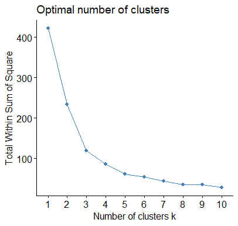
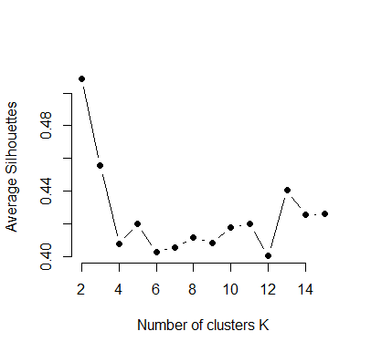
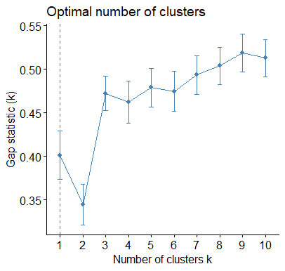
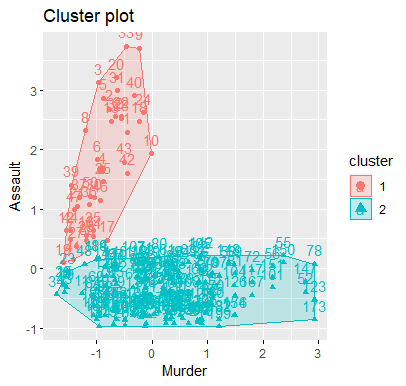

# Violent Crime Rates by US State

This repository contains an analysis of violent crime rates in the United States, focusing on clustering cities based on **murder** and **assault** rates. The project utilizes data science techniques, including hierarchical clustering and k-means clustering, to group cities and identify patterns in violent crime data.

---

## Table of Contents

- [Overview](#overview)
- [Dataset](#dataset)
- [Project Files](#project-files)
- [Key Features](#key-features)
- [Results](#results)
- [How to Run the Project](#how-to-run-the-project)


---

## Overview

The project analyzes violent crime data with the goal of identifying relationships between **murder** and **assault** rates. Using clustering techniques, cities are grouped into clusters based on their similarities in crime statistics.

### Objectives:
- Use clustering techniques to analyze violent crime data.
- Determine the optimal number of clusters using methods such as **silhouette analysis**, **scree plots**, and **gap statistics**.
- Visualize and interpret the results to better understand crime patterns.

---

## Dataset

### Description:
The dataset includes statistics on violent crime arrests (per 100,000 residents) for **murder** and **assault** across 200 cities in the United States.

### Columns:
- **City**: Name of the city (string).
- **Murder**: Murder arrests per 100,000 residents (numeric).
- **Assault**: Assault arrests per 100,000 residents (numeric).

### Source:
- McNeil, D. R. (1977). *Interactive Data Analysis*. New York: Wiley.

---

## Project Files

1. **`US_violent_crime_Cluster.R`**
   - The R script that contains the complete analysis and clustering code.
   - Includes data preprocessing, hierarchical clustering, k-means clustering, and visualization.

2. **`US_violent_crime.csv`**
   - The dataset containing violent crime statistics for 200 US cities.

---

## Key Features

- **Hierarchical Clustering**:
  - Agglomerative clustering with various linkage methods (e.g., average linkage).
  - Dendrogram generation for visualizing cluster hierarchies.

- **K-Means Clustering**:
  - Clustering cities into groups based on crime rates.
  - Determining the optimal number of clusters using:
    - Scree plots (elbow method).
      

      
    - Silhouette analysis.
      
 
      
    - Gap statistic.
      

- **Visualization**:
  - Pair plots, silhouette plots, scree plots, and cluster mappings.
  - Visualized using libraries like `factoextra` and `cluster`.

---

## Results

### Optimal Number of Clusters
- The **silhouette method** and **gap statistic** suggest an optimal number of clusters as **2**.
  

### Cluster Characteristics (K = 2):
- **Cluster 1**: Cities with higher assault rates but lower murder rates.
- **Cluster 2**: Cities with lower assault rates but higher murder rates.

#### Cluster Centers (K = 2):
| Cluster | Murder (Mean) | Assault (Mean) |
|---------|---------------|----------------|
| 1       | -0.9075537    | 1.6683283      |
| 2       | 0.2242191     | -0.4121752     |



### Additional Results (K = 4):
- When K = 4, clustering produces the following sizes: **88, 49, 23, 52 states**.
- Cluster means for Murder and Assault were calculated and visualized.

---

## How to Run the Project

### Prerequisites
Ensure you have the following installed:
- **R** (version 4.0 or higher)
- R libraries:
  - `factoextra`
  - `ggplot2`
  - `dplyr`
  - `tidyverse`
  - `cluster`
  - `ggfortify`

### Steps:
1. Clone the repository:
   ```bash
   git clone <repository_url>
   cd <repository_folder>
